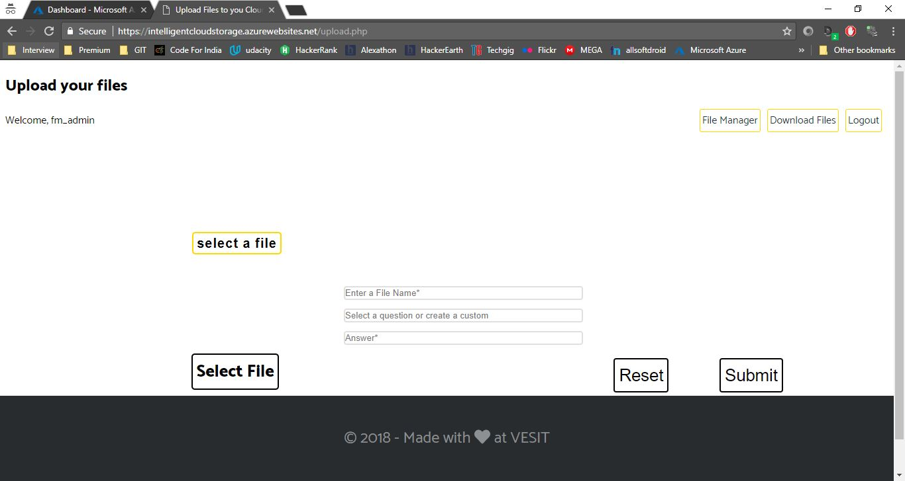

# Intelligent Cloud Storage Service For Image Classification
## This is a cloud computing mini project  (ICSSIC). This project is based on Aritificial Agent sitting behind the screen and does the classification for the user.

# Technology Used
### PHP,MySQL,HTML,CSS, Python
### Azure Cloud Storage Service
### Azure Web App

# Deployement
## For testing locally use xampp. copy all the files in the htdoc folder and copy import the database file to phpmyadmin/mysql and then call the file.

# ScreenShot
## This is a landing page

## Login and register

## upload screen 1

## upload screen 2

## file manager

## download for rest other file format

# Team Members:

### Pravin Tripathi
### Pratik Watwani
### Krishna Vanvari
### Fenil Visaria
